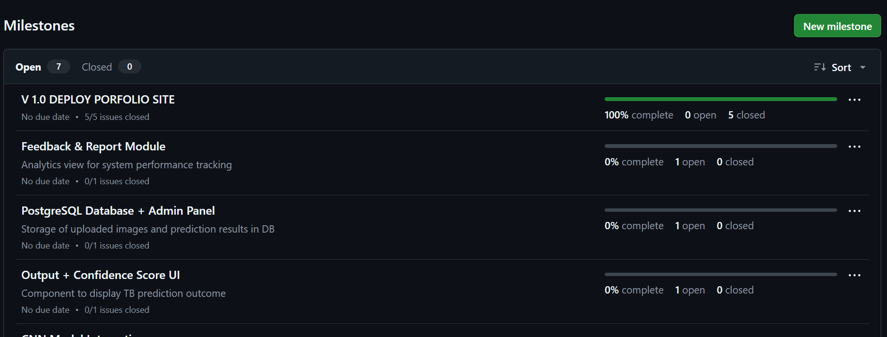
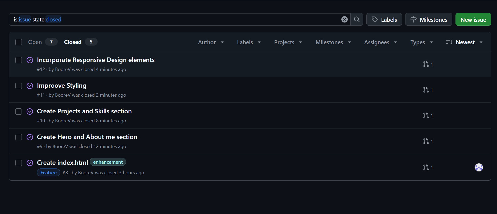
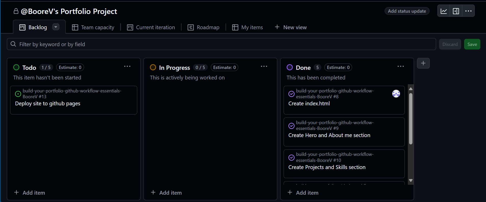
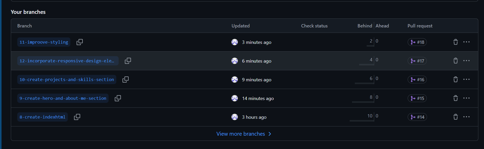
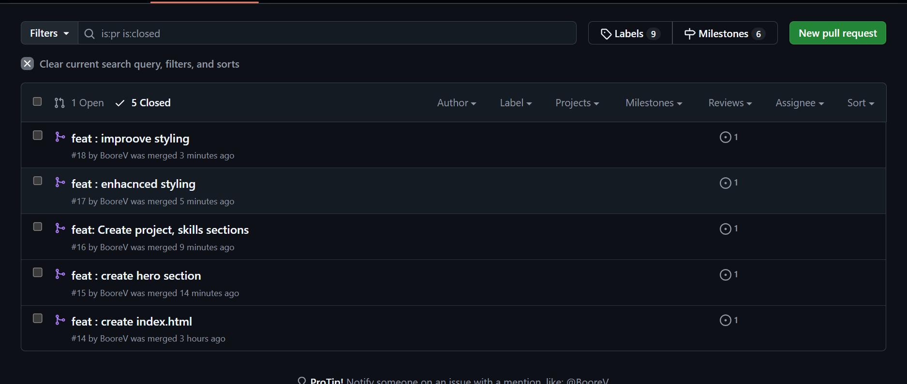

# Personal Portfolio Documentation

## 1. Student Details

| Field            | Information                    |
|------------------|--------------------------------|
| **Full Name**    | Victor Boore                   |
| **GitHub Username** | `victor-boore`                 |
| **Email**        | victor.boore@strathmore.edu       |
| **Admission Number**        | 151169        |

---

## 2. Deployed Portfolio Link

- **GitHub Pages URL**: <https://victorboore.github.io/portfolio>

---

## 3. Learnings from the Git Crash Program

| Key Concept | How it Helped My Portfolio Project |
|-------------|------------------------------------|
| **Branching** | Allowed me to develop each section (Hero, About, Projects, Skills) in isolated feature branches, preventing code conflicts and keeping `main` stable. |
| **Pull Requests & Code Reviews** | Made it easy to request feedback from peers before merging; ensured every change was tested and approved, improving overall code quality. |
| **GitHub Actions / Workflows** | Automated the build-and-deploy pipeline: every push to `main` triggers a workflow that installs dependencies, runs a simple build check, and publishes the site to GitHub Pages—no manual deployment needed. |
| **Issues & Milestones** | Helped me break the portfolio into manageable tasks (navigation bar, responsive layout, styling polish), link them to a milestone, and track progress transparently. |
| **Project Board (Kanban)** | Visualised task flow (To Do → In Progress → Done), kept me focused on one feature at a time, and provided a clear overview of project status at a glance. |

---

## 4. Screenshots of Key GitHub Features

> The images are stored in the `images/` directory of the repository.

### A. Milestones and Issues

| Screenshot | Caption |
|------------|---------|
|  | Active milestone aggregating all tasks needed for the first public release of the portfolio. |
|  | List of closed issues showing features completed and bugs fixed for v1.0. |

### B. Project Board

| Screenshot | Caption |
|------------|---------|
|  | Kanban board with columns **To Do**, **In Progress**, and **Done**; each card is linked to an issue. |

### C. Branching

| Screenshot | Caption |
|------------|---------|
|  | Meaningfully named branches like `feat/navbar`, `feat/responsive-layout`, and `fix/image-paths` to separate work streams. |

### D. Pull Requests

| Screenshot | Caption |
|------------|---------|
|  | Example PR showing automated checks (GitHub Actions) passing before merge into `main`. |

### E. Merge Conflict Resolution

> *No merge conflicts occurred during this iteration; all PRs merged cleanly thanks to disciplined branching and small, focused commits.* If a conflict arises in future work, I will document the resolution steps and include a screenshot here.

---
